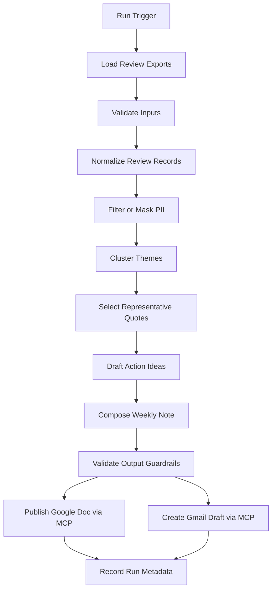
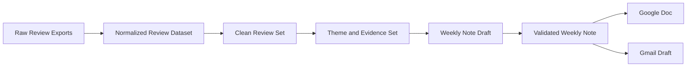
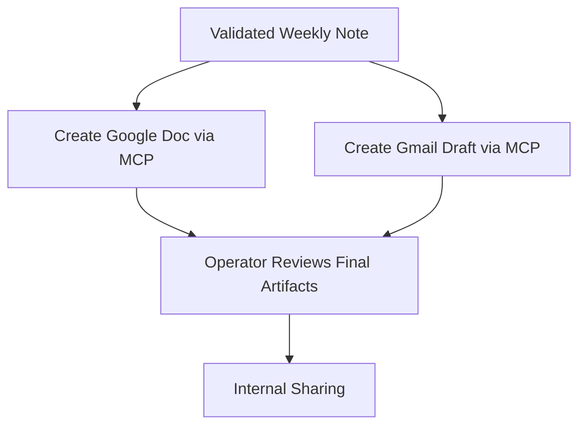

# Architecture

## Overview

The Review Advisory Agent is a weekly AI-driven workflow that converts public Groww App Store and Play Store reviews into a concise internal advisory note for stakeholders. Its purpose is not simply to summarize comments, but to turn scattered user feedback into a dependable decision-support artifact that surfaces major themes, representative evidence, and clear action suggestions in a format that can be reviewed quickly.

At a system level, the workflow ingests recent review exports, standardizes the data, removes risky content, analyzes the review set for recurring signals, drafts a weekly pulse, publishes the note to Google Docs, and prepares a Gmail draft for circulation. Google Docs and Gmail are integrated through MCP servers only. Direct API clients, custom OAuth implementations, and manual one-off integrations are explicitly out of scope.

## Business Context

### Problem Being Solved

Product and customer-facing teams often have access to large volumes of app reviews but limited time to manually read, sort, and synthesize them. Valuable patterns become easy to miss when the input stream is fragmented across stores, inconsistent in format, and noisy in quality.

The core problem is therefore not data availability, but signal extraction. The system must reduce review volume into a short weekly advisory that answers the questions internal teams actually care about:

- What are users struggling with most this week?
- Which issues appear repeatedly enough to matter?
- Which user quotes best represent the situation?
- What concrete actions should the team consider next?

### Intended Users

- Product teams that need issue clustering and prioritization support
- Growth teams that need to spot onboarding and conversion friction
- Support teams that need visibility into repeated complaints and appreciation
- Leadership that needs a lightweight weekly product health pulse

### Desired Business Outcome

Each weekly run should produce a summary that is short enough to read in minutes, grounded enough to trust, and actionable enough to influence prioritization discussions.

## Architecture Goals

### Primary Goals

- Turn raw public review data into a reliable weekly pulse.
- Create one standard process across both app stores instead of disconnected manual review.
- Preserve stakeholder trust through concise, evidence-backed summaries.
- Standardize Google Docs and Gmail interactions through MCP-native tooling.
- Keep the system straightforward enough to operate weekly without heavy overhead.

### Quality Goals

- High traceability from summary outputs back to source reviews
- Strong privacy protection across inputs, prompts, logs, and outputs
- Stable output structure across runs
- Clear failure visibility when ingestion, analysis, or MCP publication fails
- Easy operator review before information is shared more widely

### Operational Goals

- Support both manual and scheduled execution
- Make re-runs predictable and safe
- Keep the first release easy to troubleshoot
- Avoid fragile dependencies outside the stated inputs and MCP servers

## Architectural Scope

### In Scope

- fetching and storing public store-accessible Groww reviews from App Store and Play Store
- standardizing the input into a canonical review dataset
- filtering or masking risky content before analysis
- theme extraction, quote selection, and action recommendation generation
- composing a weekly one-page note
- publishing the note to Google Docs through MCP
- preparing a Gmail draft through MCP
- logging run status and maintaining basic operator visibility

### Out of Scope

- real-time streaming of reviews
- direct Google API integrations
- automatic email sending in the first release
- authenticated scraping or private-source ingestion
- advanced workflow branching for multiple products or brands in the initial version

### Planned (Phase 5)

- web frontend for weekly pulse reading and run operations visibility (see `docs/phases/phase-5/frontend-plan.md`, `design-reference.md`)
- UI references: `frontend references/stitch_groww_advisory_dashboard/` (Executive Precision Dark + 3 Stitch screens)

## Design Principles

- Build for a weekly batch cadence first, because that matches the business reporting need.
- Keep deterministic rules around data handling, structure, and guardrails wherever possible.
- Use AI for synthesis and interpretation, not for fabricating evidence.
- Separate review ingestion from insight generation so data quality issues can be isolated early.
- Enforce a human review step before external distribution beyond draft creation.
- Treat MCP as the formal integration boundary for Google productivity actions.
- Favor explainability and traceability over maximal automation.

## End-to-End System Context

```mermaid
flowchart LR
    A[Public Review Exports] --> B[Review Advisory Agent]
    B --> C[Google Docs via MCP]
    B --> D[Gmail via MCP]
    B --> E[Run Logs and Metadata]
    F[Operator or Scheduler] --> B
    G[Internal Stakeholders] <-- C
    G <-- D
```

This context shows the core architecture boundary:

- review exports are the primary upstream input
- the agent is responsible for transformation and publication
- Google Docs and Gmail are downstream systems accessed through MCP
- operators or **GitHub Actions** (weekly schedule / manual dispatch) initiate the weekly workflow
- stakeholders consume the document and email draft as the output surface

## End-to-End Processing Flow

### Narrative Flow

1. A weekly run starts through **GitHub Actions** (`schedule` cron or `workflow_dispatch`) or a local manual equivalent for development.
2. The system locates the relevant review exports for the target time window.
3. Input files are validated for structure, field presence, and basic consistency.
4. Reviews are normalized into a common schema that hides source-specific differences.
5. Potentially sensitive or unusable content is removed, masked, or excluded.
6. The cleaned review set is analyzed for recurring themes, representative quotes, and likely actions.
7. The system composes a short, scannable weekly note with a fixed structure.
8. The note is written to Google Docs through an MCP server.
9. A Gmail draft containing the same note is created through an MCP server.
10. The run records operational metadata, outcomes, and any warnings or errors.

### Detailed Flow Diagram



## Run Lifecycle and Stage Ownership

The architecture is intentionally staged so every major transformation point can be understood independently.

| Stage | Purpose | Main Output |
| --- | --- | --- |
| Triggering | start a weekly run | run context |
| Ingestion | load review sources | raw review batch |
| Normalization | standardize and clean records | canonical review dataset |
| Analysis | identify patterns and evidence | ranked themes, quotes, action ideas |
| Composition | convert insights into stakeholder-ready output | weekly note |
| Publication | publish through MCP tools | Google Doc and Gmail draft |
| Observability | record outcomes and exceptions | logs, metadata, run summary |

## Logical Components

### 1. Trigger and Run Management

This component is responsible for starting a run and carrying run identity through the entire workflow. In Phase 4, the primary trigger is **GitHub Actions**; local CLI runs remain for development and recovery.

Responsibilities:

- determine when a weekly run starts (cron schedule + optional manual dispatch)
- define the reporting window for the run (8-week lookback aligned with Phase 1)
- assign run metadata such as execution time and run identifier
- ensure the workflow can distinguish one weekly cycle from another
- map GitHub Actions run URL/id to phase `run_metadata.json` files for support

Why it matters:

- creates a stable boundary for reporting period logic
- supports repeatable operations and auditing
- allows failures to be linked back to a specific run
- centralizes secrets and scheduling without a dedicated ops server

### 2. Ingestion Layer

This component is responsible for bringing source review data into the workflow safely.

Responsibilities:

- fetch or read stored Groww review files from approved public store-accessible sources
- validate file structure and required columns
- store a dated raw snapshot for each fetch run before normalization
- load reviews from the target time window, fixed at 8 weeks for the initial release
- surface malformed inputs before downstream analysis begins

Expected outputs:

- raw review batch for the current run
- dated raw source snapshot for auditability
- source-level record counts
- ingestion warnings and failures

Failure conditions to expect:

- missing files
- incompatible export formats
- public-source coverage limits, especially for App Store pagination
- missing required fields
- date parsing failures

### 3. Review Normalization Layer

This component standardizes review data so the rest of the system does not need to care whether a review came from App Store or Play Store.

Responsibilities:

- map source-specific fields into a common schema
- standardize rating, title, body text, and date formats
- assign source identity and ingestion metadata
- remove or merge duplicates where needed
- retain only English-language reviews in the normalized dataset
- strip emojis from titles and review text before normalized storage
- drop reviews with 6 words or fewer so later phases work with richer signals
- enforce quality checks before review text enters analysis

Suggested canonical fields:

- `source`
- `rating`
- `title`
- `review_text`
- `review_date`
- `language`
- `ingested_at`
- `review_id_hash`

Normalization outcomes:

- downstream analysis receives a stable shape
- review-level traceability is maintained
- data quality issues become easier to isolate
- low-signal, emoji-heavy, and non-English reviews are filtered before later stages

### 4. Privacy and Content Safety Layer

This layer acts as a control point before any review content is used for interpretation or publication.

Responsibilities:

- detect likely personal identifiers in raw content
- mask or remove sensitive fragments
- drop records that are too risky or malformed to use safely
- reduce the chance that prompts or outputs contain personal information

Why it matters:

- protects user privacy
- reduces reputational and operational risk
- keeps the advisory focused on product feedback rather than identity details

### 5. Analysis and Insight Layer

This component converts a cleaned review dataset into structured insight candidates.

Responsibilities:

- filter low-signal or irrelevant review content
- identify recurring issue patterns
- cluster reviews into a maximum of 5 themes
- rank themes based on frequency, severity, and recurrence
- select representative evidence from real reviews
- derive draft action ideas aligned to the observed feedback

AI responsibilities in this layer:

- semantic grouping of related reviews
- theme naming
- signal prioritization
- action idea drafting

LLM provider for this layer:

- Groq is the planned LLM provider for Phase 2
- Groq should be used for semantic analysis, structured theme generation, theme naming, and summary drafting
- deterministic preprocessing should happen before any Groq call so the model receives higher-signal inputs rather than the entire raw normalized dataset

Groq operating envelope for the initial release:

- design against the `llama-3.3-70b-versatile` limits rather than the theoretical full corpus size
- cap the Phase 2 working dataset at 1,000 normalized reviews per weekly run
- do not send all 1,000 reviews directly to Groq; deterministic reduction must create smaller evidence sets first
- treat tokens-per-minute as the primary runtime limit, not requests-per-minute
- keep a safety buffer below provider limits so retries and final rendering calls remain possible

Recommended pre-LLM preparation strategy:

- partition reviews by source, rating band, and time window before analysis
- remove near-duplicate or near-identical review text where possible
- build lightweight issue candidates using deterministic signals such as repeated keywords, frequent bigrams, and complaint-heavy low-rating slices
- cap the working set to 1,000 normalized reviews before LLM analysis
- preserve all available App Store reviews when they remain within the cap, then fill the remaining budget with stratified Play Store reviews
- bias the 1,000-review cap toward complaint-heavy and neutral slices before praise-heavy slices
- send Groq batched evidence sets instead of the entire weekly corpus in one prompt
- run Groq in at least two passes: first for candidate theme discovery, then for final consolidation and note generation

Recommended call budget and throttling strategy:

- target no more than 8 discovery calls per weekly run
- reserve 1 consolidation call and 1 final weekly-note call
- keep the total Groq budget around 10 calls per weekly run
- target a total token budget of roughly 30,000 tokens or less per run
- throttle live calls to stay below approximately 4 requests per minute and 10,000 tokens per minute, leaving operational headroom under provider limits
- prefer cached dry-run artifacts during iteration so repeated development runs do not spend daily Groq budget unnecessarily

Prompt design reference:

- the detailed Groq discovery, consolidation, and final-note prompt flow is defined in `docs/phase2-groq-promptflow.md`
- the matching Python request and response contracts live in `phase-2/review_advisory_phase2/models.py`

Current Phase 1 dataset implications for Phase 2:

- the normalized dataset is heavily Play Store weighted, so source-aware weighting is needed during theme ranking
- Play Store reviews often have empty titles, so Phase 2 should rely primarily on review body text rather than title-based summarization
- ratings are polarized toward 1-star and 5-star reviews; Phase 2 treats **1–2★ as complaint/negative** and **4–5★ as praise/positive** before final consolidation
- retained review lengths vary significantly, so evidence selection should prefer representative medium-length reviews over extremely long or repetitive entries
- the current normalized dataset is larger than the desired initial Groq working set, so a deterministic 1,000-review cap is required before LLM analysis

Guardrails:

- no invented quotes
- no unsupported claims
- no more than 5 themes
- no hidden use of unfiltered sensitive content
- action ideas must stay tied to observed feedback, not speculation
- Groq prompts must operate on curated evidence slices, not on raw unbounded dumps of the full dataset
- Phase 2 must respect the provider rate and token limits without relying on best-case latency or no-retry assumptions

### 6. Weekly Note Composition Layer

This component turns analysis outputs into a consistent artifact designed for human consumption.

Responsibilities:

- enforce the final note structure
- keep the content concise and scannable
- highlight the most important themes
- include only representative quotes that support the summary
- present action ideas clearly and briefly

Suggested note structure:

- title and reporting period
- short opening summary
- top 3 themes
- 3 representative user quotes
- 3 action ideas
- optional footer with source coverage or run context

Composition quality rules:

- fit within the target word budget
- avoid repetitive phrasing
- avoid excessive detail that weakens scannability
- preserve a professional internal tone

### 7. Output Validation Layer

Before publication, the note should pass a lightweight validation step.

Responsibilities:

- confirm structural completeness
- confirm theme and quote limits are respected
- confirm no PII appears in final text
- confirm the content is suitable for both document and email channels
- reject or flag output that violates constraints

This layer is important because it separates generation from release readiness.

### 8. MCP Integration Layer

This component handles all external productivity actions.

Responsibilities:

- connect to Google Docs MCP tools to create or update the weekly note
- connect to Gmail MCP tools to create the review draft email
- surface MCP-specific failures clearly
- support safe retry behavior where possible

Constraints:

- Google Docs must be accessed through MCP only
- Gmail must be accessed through MCP only
- the initial release should draft emails, not send them automatically

Architectural implications:

- external publishing logic is standardized
- integration behavior depends on MCP permissions and availability
- testing must verify MCP behavior directly, not via substituted API assumptions

### 9. Orchestration Layer

This component coordinates how the stages connect and in what order decisions are enforced. For recurring production-style execution, orchestration is implemented as a **GitHub Actions workflow** that runs Phases 1–3 in sequence on a weekly cadence.

Responsibilities:

- manage the stage sequence
- pass outputs from one stage to the next
- stop publication when critical validation fails
- capture stage-level success and failure states
- support predictable re-run behavior
- expose run history, logs, and artifacts through GitHub Actions

Planned triggers: weekly `schedule` (cron) and `workflow_dispatch` (manual). Secrets live in GitHub repository settings (`GROQ_API_KEY`, `GOOGLE_DOC_ID`, `GMAIL_DRAFT_TO`, optional `MCP_SERVER_URL`). Upload phase output directories as workflow artifacts.

Suggested orchestration stages:

- start workflow run (GitHub Actions run id + per-phase `run_id`)
- Phase 1: fetch → normalize → `normalized_reviews.json`
- Phase 2: Groq → `weekly_pulse.json`
- Phase 3: MCP publish (Google Doc append + Gmail draft)
- upload artifacts and record outcome

### 10. Presentation Layer (Phase 5 — planned)

A **React + Vite** SPA with **FastAPI** read API sits on top of batch outputs—not replacing the Python pipeline. Visual design follows **Executive Precision Dark** (see `docs/phases/phase-5/design-reference.md`).

Responsibilities:

- render `weekly_pulse.json` on three stakeholder routes aligned to Stitch mockups: **Summary** (`/`), **Themes** (`/themes`), **Quotes** (`/quotes`)
- list historical runs and show Phase 1–3 metadata on **`/runs`** and **`/runs/:runId`**
- surface coverage notes, source mix, and publication status (Doc append, Gmail draft)
- link out to Google Doc, Gmail, and GitHub Actions where appropriate
- optional: trigger `workflow_dispatch` through the API (never expose secrets in the browser)

Constraints:

- read-only relative to review analysis logic; no Groq or MCP calls from the browser
- same PII rules as published artifacts
- depends on `runs_index.json` or API populated after Phase 4 runs

Stack (Decision 015): React 18, TypeScript, Tailwind, lucide-react on **Vercel**; FastAPI on **Render**. No auth in v1.

### 11. Observability and Operations Layer

This component exists to make the system supportable in real use.

Responsibilities:

- emit structured logs for each stage
- track warnings, counts, and duration
- preserve enough operational context for debugging
- make it clear whether failures happened in ingestion, analysis, validation, or MCP publication
- support operator review and recovery

Recommended tracked signals:

- run identifier
- reporting period
- reviews ingested
- reviews dropped
- validation warnings
- themes generated
- summary word count
- Google Docs publication status
- Gmail draft status
- overall run result
- failure stage when applicable

## Information Flow and Artifact States



The architecture deliberately changes the form of the data at each stage:

- raw exports are source-owned and inconsistent
- normalized records are system-owned and structured
- clean review sets are analysis-ready
- theme and evidence sets are interpretation-ready
- the weekly note draft is stakeholder-readable but not yet releasable
- the validated weekly note is publication-ready

## Publication Flow and Human Review Model

The workflow is designed to end with publish-ready assets, but not with fully autonomous communication.



This model is intentional:

- the system automates analysis and draft generation
- the human operator retains final control before broader circulation
- trust is built through reviewable artifacts rather than opaque automation

## Data and Content Boundaries

### Inputs

- public App Store review exports
- public Play Store review exports
- reporting window or weekly run context

### Internal Artifacts

- raw review batch
- normalized review dataset
- sanitized review set
- clustered themes
- selected evidence quotes
- proposed action ideas
- weekly note draft
- run metadata and logs

### Published Artifacts

- Google Doc containing the weekly pulse
- Gmail draft for internal review and sharing

## Error Handling Model

The architecture should treat failures as stage-specific, not generic.

### Ingestion Failures

- missing inputs
- unsupported formats
- insufficient valid records

Expected behavior:

- stop the run early
- record a clear cause
- avoid partial downstream outputs

### Analysis Failures

- low-quality or empty clean dataset
- unstable theme generation
- evidence gaps that prevent trustworthy output

Expected behavior:

- prevent publication
- flag the run for review
- preserve enough context for diagnosis

### Publication Failures

- Google Docs MCP failure
- Gmail MCP failure
- partial success in one publish target only

Expected behavior:

- record target-specific outcome
- preserve successful artifacts where they exist
- allow safe retry or operator intervention

## Security, Privacy, and Trust Controls

- Do not include usernames, email addresses, IDs, or other identifiable details in output artifacts.
- Sanitize or exclude reviews containing risky personal content.
- Keep prompts focused on product feedback rather than identity markers.
- Ensure all final quotes are taken from actual reviews and remain meaningfully faithful to source text.
- Keep logging focused on operational metadata rather than unnecessary raw content.
- Require human review before any email is actually sent.

## Assumptions

- public store-accessible review sources are available at the required cadence
- both stores provide enough structured information for common normalization
- internal users prefer a concise weekly advisory over a longer research document
- MCP server access for Google Docs and Gmail can be configured in the target environment
- the first release prioritizes reliability and clarity over advanced analytics depth

## Non-Goals

- real-time review monitoring
- auto-sending production emails without review
- direct Google API integrations
- private-source scraping or authenticated extraction
- sentiment dashboards or BI-style analytics in the first release
- multi-brand support in the first release

## Future Evolution Areas

- persistence choices for normalized review history
- more advanced ranking logic for severity and trend movement
- multilingual review handling
- richer stakeholder-specific document variants
- stronger idempotency rules for repeated weekly runs
- GitHub Actions notifications (Slack/email on failure) without changing the core MCP publish model
- optional long-term trend reporting across multiple weeks
