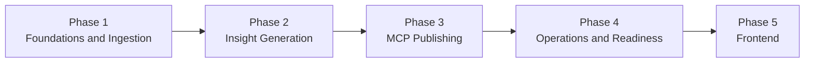

# Implementation Plan

## Delivery Approach

The Review Advisory Agent should be delivered in phases so that each stage reduces uncertainty, creates a usable intermediate outcome, and builds toward a reliable end-to-end workflow. The goal of this plan is not to describe implementation code, but to define how the project should be executed, validated, and advanced from one maturity level to the next.

Each phase must end with a documented evaluation before the next phase begins. Evaluation files live here:

- `docs/phases/phase-1/eval.md`
- `docs/phases/phase-2/eval.md`
- `docs/phases/phase-3/eval.md`
- `docs/phases/phase-4/eval.md`
- `docs/phases/phase-5/eval.md`

## Planning Principles

- Deliver value in a sequence that reduces project risk early.
- Establish trust in the data before investing in higher-level intelligence.
- Validate summary quality before integrating external publishing actions.
- Use MCP as the standard external tool boundary for Google Docs and Gmail.
- Treat evaluation and exit criteria as release gates, not optional documentation.
- Record only major technical or logical decisions in `docs/decision.md`.

## Overall Delivery Sequence



The sequencing is deliberate:

- Phase 1 builds trust in the incoming data.
- Phase 2 builds trust in the generated insight.
- Phase 3 builds trust in the external publishing flow.
- Phase 4 builds trust in repeatable operations.
- Phase 5 makes outputs and run status accessible through a web UI (after pipeline trust is established).

## Phase 1: Foundations and Review Ingestion

### Objective

Establish the system foundation and create a dependable path for fetching, storing, and loading real Groww App Store and Play Store reviews into a clean, analysis-ready review dataset.

### Why This Phase Comes First

If the incoming review data is incomplete, inconsistent, or unsafe, every later phase will inherit those problems. This phase exists to make the review input trustworthy before the project begins generating any insights or publishing any outputs.

### Desired Outcome

At the end of Phase 1, the team should be able to fetch and store a dated raw snapshot of Groww reviews for the last 8 weeks, then run ingestion to produce a stable, canonical review dataset with basic privacy controls and reliable operational visibility.

### In Scope

- define the operational foundation for the weekly workflow
- establish the canonical review schema
- fetch and store real Groww reviews from approved public store-accessible sources
- preserve a dated raw source snapshot for each fetch run
- normalize App Store and Play Store inputs into one common representation
- apply record validation, filtering, and deduplication rules
- retain only English-language reviews after normalization
- strip emojis from normalized titles and review text
- exclude reviews with 6 words or fewer from the normalized working dataset
- introduce privacy controls before downstream interpretation
- capture ingestion counts, warnings, and failure states

### Explicitly Out of Scope

- theme generation
- summary drafting
- Google Docs publication
- Gmail draft creation
- scheduling optimization beyond what is needed for basic execution planning

### Key Workstreams

#### Workstream 1: Input Source Definition

- confirm which public store-accessible sources are accepted for Groww
- define the expected reporting window as the latest 8 weeks
- document minimum required fields per source
- identify known format differences between stores

#### Workstream 2: Canonical Data Definition

- define the review record shape used throughout the project
- decide how source identity, review dates, ratings, and text will be represented
- define what constitutes a valid review record for downstream use

#### Workstream 3: Data Quality Controls

- determine how malformed or incomplete rows are handled
- determine how duplicates are identified and treated
- define how English-only filtering will work when explicit language metadata is missing
- define the minimum review-length threshold for downstream usefulness
- define how emojis and other low-signal symbols are removed during normalization
- define what happens when there are too few valid reviews in a run

#### Workstream 4: Privacy Safeguards

- identify likely PII patterns in review content
- define masking, exclusion, or sanitization rules
- ensure unsafe text does not flow into later stages

#### Workstream 5: Run Visibility

- define which ingestion metrics must be captured
- ensure failures are understandable to an operator
- make it possible to differentiate source issues from system issues

### Deliverables

- documented approved inputs and assumptions
- dated raw Groww review snapshot for each fetch run
- canonical review schema
- repeatable ingestion workflow
- normalized dataset suitable for downstream analysis
- documented privacy controls for review text handling
- basic ingestion logs and run metadata

### Dependencies

- access to public store-accessible Groww reviews
- agreement on the fixed 8-week reporting window
- agreement on the minimum fields required for analysis

### Main Risks

- public source structures may differ more than expected across stores
- App Store public pagination may not expose the full 8-week window for a high-volume app
- some review rows may lack enough structure for safe normalization
- missing language metadata may require heuristic English detection
- aggressive short-review filtering may reduce dataset size more than expected
- privacy filtering may be too weak or too aggressive
- low-quality source data may create blind spots in later analysis

### Review Checkpoints

- checkpoint 1: source formats and accepted inputs are documented
- checkpoint 2: canonical schema is approved
- checkpoint 3: fetching and ingestion work on real Groww reviews from both stores
- checkpoint 4: privacy filtering is validated on edge-case inputs
- checkpoint 5: English-only, emoji-removal, and minimum-word-count filters behave as intended

### Handoff to Phase 2

Phase 2 should only begin once the team is confident that the dataset is stable enough to support theme extraction and summary generation without frequent ingestion-level surprises.

## Phase 2: Review Intelligence and Weekly Note Generation

### Objective

Transform the normalized review dataset into a concise and trustworthy weekly advisory note that surfaces major themes, representative quotes, and suggested actions.

### Why This Phase Matters

This phase is where the project becomes valuable to business stakeholders. A technically functioning system is not enough if the outputs are noisy, ungrounded, too long, or not useful for prioritization discussions.

### Desired Outcome

At the end of Phase 2, the team should be able to generate a one-page weekly note from a representative review set and defend its outputs as evidence-based, concise, and useful.

### In Scope

- identify recurring themes in the normalized review set
- cap theme volume so the result remains actionable
- select representative quotes that genuinely reflect user feedback
- generate action ideas connected to observed issues
- compose a fixed-format weekly note
- validate output quality and guardrails before publication
- use Groq as the Phase 2 LLM provider
- operate within the Groq rate and token limits for the initial release

### Explicitly Out of Scope

- publishing to Google Docs
- creating Gmail drafts
- full operational scheduling
- advanced long-term analytics or trend dashboards

### Key Workstreams

#### Workstream 1: Insight Framing

- define how the system determines what is important in a given week
- clarify how frequency, severity, and recurrence influence prioritization
- define how top themes are chosen from the larger review pool

#### Workstream 1A: Pre-LLM Evidence Shaping

- define what deterministic preprocessing happens before Groq sees the data
- decide how reviews are grouped into evidence batches instead of sending the whole dataset in one prompt
- determine how source balance, rating polarity, and review length influence batching and ranking
- define how near-duplicate or repetitive reviews are reduced before semantic analysis
- define how the normalized dataset is capped to a 1,000-review working set before Groq analysis
- define how the 1,000-review cap favors complaint-heavy and neutral reviews while preserving App Store coverage

#### Workstream 1B: Rate-Limit-Aware Execution

- design the Groq call plan around token-per-minute as the primary constraint
- define a call budget for discovery, consolidation, and final-note generation
- keep enough request and token headroom for retries, failures, and validation reruns
- define when dry runs should be used instead of live Groq calls during development

#### Workstream 2: Theme Quality

- ensure theme labels are understandable to non-technical stakeholders
- prevent over-fragmentation into too many micro-themes
- prevent over-merging unrelated issues into one vague bucket
- use Groq for semantic grouping and theme naming after the pre-LLM filtering stage

#### Workstream 3: Evidence Selection

- define what makes a quote representative
- ensure selected quotes are faithful to real review content
- ensure evidence is distributed across the most important issues rather than clustered around a single problem

#### Workstream 4: Actionability

- ensure action ideas are realistic and rooted in observed feedback
- prevent generic or overly speculative recommendations
- align suggested actions with stakeholder needs for prioritization and follow-up
- ensure Groq-generated actions can be traced back to review evidence slices rather than broad corpus impressions

#### Workstream 5: Output Shape and Consistency

- keep the note concise and easy to scan
- preserve a consistent structure across weekly runs
- ensure the note reads like an internal advisory, not raw generated prose
- use Groq for final consolidation only after deterministic limits and evidence sets are fixed

### Phase 2 Strategy Based on Current Phase 1 Data

The current normalized Phase 1 snapshot suggests a hybrid strategy rather than a single broad LLM prompt:

- the retained dataset is strongly Play Store dominated, so source-aware weighting is needed during ranking
- Play Store titles are often absent, so the review body should be treated as the primary text signal
- ratings are polarized between strong complaints and strong praise, so Phase 2 should analyze low-rating and high-rating evidence separately before consolidation
- review lengths vary materially, so quote and evidence selection should avoid letting long outliers dominate the final note
- the current normalized dataset is larger than the intended initial Groq working set, so deterministic capping is required before live LLM analysis

### Groq Limit-Aware Operating Plan

The initial release should be built specifically around the Groq limits for `llama-3.3-70b-versatile`:

- requests per minute: `30`
- requests per day: `1,000`
- tokens per minute: `12,000`
- tokens per day: `100,000`

In practice, the token-per-minute limit is the tighter operational constraint for Phase 2. The design should therefore optimize for token control first and request count second.

### 1,000-Review Working-Set Strategy

The current implementation should target a maximum of `1,000` normalized reviews per weekly run for live Groq analysis.

Recommended prioritization order:

1. retain all available App Store reviews while they remain within the cap
2. apply the remaining budget to Play Store reviews using deterministic stratified selection
3. prioritize `1-2` star reviews first, then `3` star reviews, then `4-5` star reviews
4. prefer more recent and less repetitive reviews when multiple reviews compete for the same budget

This approach keeps strong complaint coverage, preserves scarce App Store evidence, and prevents positive-review volume from dominating token usage.

Recommended strategy:

1. apply deterministic slicing first: by source, rating band, and review date
2. cap the working set to 1,000 reviews using the agreed prioritization strategy
3. derive initial issue candidates from repeated phrases and high-frequency complaint areas
4. send Groq smaller evidence batches for semantic grouping and theme naming
5. consolidate Groq outputs into no more than 5 candidate themes
6. run a final Groq pass for top-theme ranking, representative quote selection, and action drafting using only curated evidence

Recommended live-call budget:

- discovery stage: target no more than `8` Groq calls
- consolidation stage: `1` Groq call
- final weekly-note generation: `1` Groq call
- total target: about `10` Groq calls per weekly run

Recommended token budget:

- keep total token usage for one weekly run at roughly `30,000` tokens or less
- keep live throughput under roughly `10,000` tokens per minute to preserve safety margin below the `12,000` TPM limit
- keep live throughput under roughly `4` requests per minute even though the provider allows more, because token usage is the tighter limiter
- prefer dry runs and cached intermediate artifacts during prompt iteration so the daily `100,000` token cap is not burned during development

Prompt design reference:

- the concrete Groq prompt sequence for discovery, consolidation, and final note generation is documented in `docs/phase2-groq-promptflow.md`
- the matching Python request and response contracts live in `phase-2/review_advisory_phase2/models.py`

### Deliverables

- defined weekly note structure
- defined Groq prompting and batching strategy
- documented Groq prompt flow for discovery, consolidation, and final note generation
- documented Groq call budget and token budget for the initial release
- stable theme selection and prioritization approach
- evidence selection standards for user quotes
- action recommendation standards
- final weekly note output ready for publication in later phases

### Dependencies

- a trusted normalized dataset from Phase 1
- enough normalized real reviews to evaluate summary quality
- stakeholder alignment on what constitutes a useful weekly pulse
- agreement to use Groq as the LLM provider for Phase 2
- agreement on the initial 1,000-review working-set cap

### Main Risks

- themes may be too broad, too narrow, or inconsistent across runs
- quotes may be technically valid but not truly representative
- action ideas may become generic or weakly supported
- the note may exceed the target length or become too dense to scan quickly
- sending too much uncurated review text to Groq may reduce theme quality and increase prompt noise
- source imbalance may cause Groq to overweight Play Store issues if batching is not designed carefully
- poor review-cap selection may hide less frequent but important issues
- repeated development runs can consume the daily Groq token budget faster than the production weekly workflow

### Review Checkpoints

- checkpoint 1: note structure is agreed and stable
- checkpoint 2: Groq prompting, evidence-batching, and 1,000-review cap strategy are agreed
- checkpoint 3: the Phase 2 live-call plan fits within the Groq request and token limits with safety margin
- checkpoint 4: theme quality is reviewed on representative normalized real-review data
- checkpoint 5: quotes are verified as traceable and representative
- checkpoint 6: action ideas are reviewed for usefulness and grounding
- checkpoint 7: final note quality is judged acceptable by intended readers

### Handoff to Phase 3

Phase 3 should only begin once the team is satisfied that the generated note is worth publishing. There is little value in integrating Google Docs and Gmail before the content itself is trustworthy.

## Phase 3: MCP Integrations for Google Docs and Gmail

### Objective

Publish the weekly advisory through MCP-native Google Docs and Gmail integrations without introducing direct API-based publication paths.

### Why This Phase Matters

This phase turns the internal note into a usable business artifact. It also proves that the project follows the intended integration strategy rather than drifting into custom API work that increases complexity and long-term maintenance burden.

### Desired Outcome

At the end of Phase 3, the team should be able to take a validated weekly note and consistently publish it to Google Docs and create a Gmail draft through MCP servers.

### In Scope

- define the Google Docs publication behavior
- define the Gmail draft creation behavior
- ensure both integrations use MCP servers only
- decide how repeated runs are handled at the publication layer
- define failure handling and recovery expectations for external tool issues
- preserve the human review model before outbound communication

### Explicitly Out of Scope

- direct Google API integration
- automated email sending in the first release
- advanced collaboration workflows beyond document creation and draft preparation

### Key Workstreams

#### Workstream 1: Google Docs Publication Model

- determine whether the system creates a new document each run or updates a controlled destination
- define how the reporting period should appear in the document
- define minimum formatting expectations for readability

#### Workstream 2: Gmail Draft Model

- define the subject and body expectations for the weekly draft
- define who receives the draft by default
- ensure the draft is suitable for quick review and manual send decisions

#### Workstream 3: MCP Boundary Enforcement

- verify that Google Docs interactions go only through MCP
- verify that Gmail interactions go only through MCP
- make the integration approach explicit enough that later work does not accidentally introduce direct API paths

#### Workstream 4: Failure and Retry Model

- define what happens if document creation succeeds but draft creation fails
- define which failures should block the run
- define how operators should retry safely after an MCP error

#### Workstream 5: Publication Consistency

- ensure the published document matches the approved weekly note
- ensure the Gmail draft content stays aligned with the document content
- define how duplicate or repeated publications are handled

### Deliverables

- documented Google Docs publication behavior through MCP
- documented Gmail draft behavior through MCP
- clear publication rules for repeated runs
- operator guidance for handling publication failures
- verified MCP-only external integration model

### Dependencies

- a stable weekly note output from Phase 2
- available MCP servers and required permissions
- agreement on document and email review expectations

### Main Risks

- MCP permissions or availability may block end-to-end success
- document and email formatting expectations may diverge
- repeated runs may create duplicate artifacts if publication rules are unclear
- a partial publish state may confuse operators if recovery rules are weak

### Review Checkpoints

- checkpoint 1: Google Docs publication path is defined and validated
- checkpoint 2: Gmail draft path is defined and validated
- checkpoint 3: MCP-only integration boundary is confirmed
- checkpoint 4: failure and retry behavior is documented and tested
- checkpoint 5: published artifacts are reviewed for consistency and readability

### Handoff to Phase 4

Phase 4 should only begin once publication works reliably enough that the remaining challenge is operations, supportability, and recurring execution rather than core functionality.

## Phase 4: Orchestration, Operations, and Production Readiness

> **Status:** Implemented — `.github/workflows/weekly-review-advisory.yml`, `requirements-ci.txt`, `scripts/ci/`, `docs/phases/phase-4/OPERATOR_RUNBOOK.md`.

### Objective

Make the entire workflow dependable for repeated weekly use with clear run control, observability, recovery guidance, and operational ownership—using **GitHub Actions** as the primary scheduler and execution environment for scheduled weekly runs.

### Why This Phase Matters

A system that works once is not yet operational. This phase ensures the workflow can be repeated over time, supported by operators, and understood when something goes wrong. Automating the weekly cadence in CI reduces reliance on a single machine and makes run history, secrets, and failure signals visible in one place.

### Desired Outcome

At the end of Phase 4, the team should be able to:

- run the full pipeline on a **weekly GitHub Actions schedule** (with optional manual `workflow_dispatch`)
- inspect run logs, artifacts, and per-phase metadata from each workflow run
- retry or re-run safely after partial failures (especially Phase 3 publish)
- operate the system with a short runbook rather than builder-only knowledge

### In Scope

- define the end-to-end orchestration of Phases 1 through 3 inside a single workflow (or clearly sequenced jobs)
- implement **GitHub Actions** for scheduled weekly execution and manual re-runs
- store required secrets in **GitHub repository secrets** (Groq, MCP server URL if needed, `GOOGLE_DOC_ID`, `GMAIL_DRAFT_TO`, and any fetch credentials if applicable)
- upload phase output directories as **workflow artifacts** for audit and debugging
- establish run status visibility and logging expectations in CI logs
- define partial failure handling and recovery steps (job boundaries, `continue-on-error` only where explicitly allowed)
- document operator responsibilities and runbook expectations
- prepare the project for stable recurring use

### Explicitly Out of Scope

- broad productization beyond the defined weekly advisory use case
- large-scale analytics expansion
- full organizational rollout to multiple brands or business lines
- alternative schedulers (cron on a VM, Airflow, etc.) for the initial release—GitHub Actions is the chosen path

### Key Workstreams

#### Workstream 1: GitHub Actions Weekly Workflow

- add a workflow under `.github/workflows/` (e.g. `weekly-review-advisory.yml`)
- trigger on a **weekly cron** (e.g. Monday 06:00 UTC) plus **`workflow_dispatch`** for manual runs
- run on `ubuntu-latest` with a pinned Python version aligned with local development
- sequence jobs or steps: Phase 1 fetch/ingest → Phase 2 Groq analysis → Phase 3 MCP publish
- pass reporting window via env or workflow inputs (default: last 8 weeks ending at run date)
- fail the workflow if any required phase exits non-zero unless a documented recovery path applies

Recommended workflow structure:

```text
on:
  schedule: cron weekly
  workflow_dispatch: optional inputs (dry_run, skip_publish)

jobs:
  weekly-pulse:
    steps:
      - checkout
      - setup-python
      - phase-1 (fetch + normalize) → artifact phase1-output/
      - phase-2 (Groq) → artifact phase2-output/
      - phase-3 (MCP publish) → artifact phase3-output/
      - summary step (echo run_metadata paths / status)
```

#### Workstream 2: End-to-End Run Control

- define how a run starts, progresses, and completes in CI
- define stage-level gating between ingestion, analysis, validation, and publication
- define how run identity and reporting windows are tracked (reuse each phase’s `run_metadata.json`)
- align GitHub Actions **run id** with phase `run_id` fields in logs for traceability

#### Workstream 3: Observability

- define the minimum logs, counts, and statuses needed to support the workflow
- ensure operators can see where and why a run failed from the Actions log and uploaded artifacts
- make stage-level outcomes easy to interpret (job summary or final step printing JSON status)

#### Workstream 4: Recovery and Re-run Strategy

- define how the system behaves after a failed or partially successful run
- define what can be retried safely (`workflow_dispatch` re-run; Phase 3-only re-run from existing `weekly_pulse.json` when Phases 1–2 succeeded)
- define how to avoid confusion or duplication after re-runs (Phase 3 `--skip-publish-if-unchanged`, dedicated Google Doc per stream, or operator awareness of append-only behavior)

#### Workstream 5: Operating Model

- document who reviews outputs (Google Doc + Gmail draft)
- document who investigates failures (Actions run + artifacts)
- document how weekly execution should be monitored (Actions notifications, optional failure email later)
- document what evidence is required before considering the workflow stable

#### Workstream 6: Release Readiness

- confirm cross-phase standards are met
- confirm all phase evaluations are complete
- confirm the workflow can be handed off and supported without relying on undocumented assumptions
- verify secrets are configured in GitHub and not committed to the repository

### Deliverables

- `.github/workflows/weekly-review-advisory.yml` (or equivalent) with schedule + manual dispatch
- end-to-end operational workflow definition (this plan + architecture)
- operator runbook (how to trigger, read artifacts, retry)
- logging and status expectations for CI runs
- failure recovery guidance
- release readiness checklist
- documented list of **required GitHub secrets**

### Dependencies

- completion of Phases 1 through 3
- documented evaluation outcomes from earlier phases
- agreement on operator ownership and review process

### Main Risks

- poor observability may make failures expensive to diagnose
- repeated runs may create inconsistencies if stage outcomes are not tracked clearly
- the system may remain dependent on builder knowledge if runbooks are weak
- operational overhead may become too high if the process is not simplified

### Review Checkpoints

- checkpoint 1: GitHub Actions workflow runs Phases 1–3 in order on `workflow_dispatch`
- checkpoint 2: weekly cron schedule is configured and documented (timezone, day, failure expectations)
- checkpoint 3: secrets and artifacts are verified; no credentials in repo or logs
- checkpoint 4: logging and run visibility are sufficient for support from Actions UI
- checkpoint 5: recovery and retry paths are reviewed (full re-run vs Phase 3-only)
- checkpoint 6: operator documentation is complete enough for handoff
- checkpoint 7: the workflow is judged ready for recurring weekly execution

### Completion Condition

This phase is complete when the team is confident that the workflow is not only functional, but sustainable as a recurring operational process.

## Phase 5: Frontend & Operator Experience

> **Planning status:** Design references incorporated (Stitch mockups + Executive Precision Dark). Full detail: `docs/phases/phase-5/frontend-plan.md`, mapping: `docs/phases/phase-5/design-reference.md`. Assets: `frontend references/stitch_groww_advisory_dashboard/`.

### Objective

Provide a web frontend so stakeholders can read the weekly pulse in a fixed, scannable layout and operators can inspect run history, phase status, and publication outcomes—without opening raw JSON or GitHub Actions for every question.

### Why This Phase Matters

Phases 1–4 optimize for **correct batch output**. Phase 5 optimizes for **adoption**: Product, Growth, Support, and Leadership need a familiar surface (browser) and clear run health, or the pipeline stays builder-centric.

### Desired Outcome

- a deployed UI showing the latest weekly pulse (summary, themes, quotes, actions, coverage)
- run history and detail views grounded in Phase 1–3 `run_metadata.json`
- optional links to Google Doc / Gmail draft and GitHub Actions runs
- no PII and no secrets in the client
- stack and visuals aligned with Stitch references and Executive Precision Dark (Decision 015)

### In Scope

- UX for weekly pulse reader and run history/detail
- frontend application (React + Vite + TypeScript + Tailwind per Decision 015)
- read-only consumption of `weekly_pulse.json` and run metadata
- optional thin API layer to list runs and serve JSON (recommended)
- optional `workflow_dispatch` trigger from UI (v1.1, server-side token only)
- CI build/deploy: frontend **Vercel**, API **Render**; no auth
- post–Phase 4 artifact index or publish step for UI data refresh

### Explicitly Out of Scope (initial release)

- reimplementing ingestion, Groq, or MCP logic in the browser
- direct Google APIs from the frontend
- full analytics dashboard, sentiment charts, or multi-app tenancy
- auto-send email from the UI

### Key Workstreams

See `docs/phases/phase-5/frontend-plan.md` for workstreams 1–6 (UX, app, data layer, operator integrations, CI/CD, security).

Summary:

1. **UX & design** — Stitch screens: Summary, Themes, Quotes (`design-reference.md`)  
2. **Frontend app** — routes: `/`, `/themes`, `/quotes`, `/runs`, `/runs/:runId`  
3. **Data layer** — static artifacts and/or API + `runs_index.json`  
4. **Operator integrations** — Actions links, optional trigger  
5. **Deploy** — hosting per references  
6. **Privacy review** — PII and secret handling  

### Architecture direction (proposed)

| Option | Summary |
|--------|---------|
| Static + published JSON | Simplest; weekly refresh from CI artifacts |
| **API + SPA (default)** | FastAPI (or similar) serves run index; UI fetches JSON |
| GitHub API–centric | Fewer moving parts; heavier token/ops setup |

**Decision 015 accepted:** React SPA + FastAPI read API; see `docs/decision.md`.

### Dependencies

- stable Phase 2 `weekly_pulse.json` schema  
- Phase 1–3 metadata for operator views  
- Phase 4 publishing artifacts or index for fresh data  
- design references incorporated; deploy: Vercel + Render; no auth  

### Main Risks

- late references delay visual implementation  
- UI scope creep into analytics  
- stale data if artifact publish step is missing  
- exposing secrets if “run now” is implemented in the browser  

### Review Checkpoints

- checkpoint 1: references mapped to wireframes and stack  
- checkpoint 2: pulse page matches 3/3/3 product structure  
- checkpoint 3: run history accurate vs metadata  
- checkpoint 4: PII/security review passed  
- checkpoint 5: stakeholder read experience sign-off  
- checkpoint 6: deployment and data refresh documented  

### Handoff

No further pipeline phase is defined after Phase 5. Future work (notifications, multi-app, analytics) should be new decisions in `docs/decision.md`.

## Cross-Phase Standards

- All Google Docs and Gmail interactions must use MCP servers.
- No PII may appear in prompts, outputs, logs, documents, or drafts.
- Every phase must produce evidence that matches its evaluation file.
- Exit criteria must be met before the next phase begins.
- Only major technical or logical decisions should be recorded in `docs/decision.md`.
- Human review remains part of the communication loop in the initial release.

## Phase Gate Summary

| Phase | Core Question Before Moving Forward |
| --- | --- |
| Phase 1 | Do we trust the review dataset enough to build insights on top of it? |
| Phase 2 | Do we trust the generated note enough to publish it internally? |
| Phase 3 | Do we trust the MCP publishing flow enough to use it consistently? |
| Phase 4 | Do we trust the workflow enough to run it every week with reasonable operational effort? |
| Phase 5 | Can stakeholders and operators use the UI as the default way to read the pulse and understand run status? |

## Suggested Execution Order

1. Complete Phase 1 and establish trust in the data pipeline.
2. Complete Phase 2 and establish trust in the generated weekly advisory.
3. Complete Phase 3 and establish trust in MCP-based publication.
4. Complete Phase 4 and establish trust in recurring operations via **GitHub Actions** (see `docs/phases/phase-4/README.md` and `.github/workflows/weekly-review-advisory.yml`).
5. Execute Phase 5 (`docs/phases/phase-5/frontend-plan.md`) — references incorporated.
