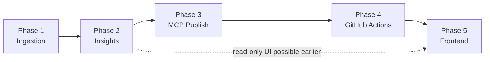

# Phase 5 Plan: Frontend & Operator Experience

## Purpose

Extend the Review Advisory Agent with a **web frontend** that makes weekly outputs easy to consume and weekly operations easy to monitor. The backend pipeline (Phases 1–4) remains the source of truth for ingestion, Groq analysis, MCP publication, and scheduled runs via GitHub Actions.

**Design references are incorporated.** See `design-reference.md` and `frontend references/stitch_groww_advisory_dashboard/`.

---

## Reference inputs (incorporated)

| # | Source | Status |
|---|--------|--------|
| 1 | **UI mockups** — 3 Stitch screens (Summary, Themes, Quotes) | ✅ `frontend references/.../screen.png` |
| 2 | **Design system** — Executive Precision Dark | ✅ `executive_precision_dark/DESIGN.md` |
| 3 | **Hosting target** | ✅ **Vercel** (frontend) + **Render** (FastAPI backend) |
| 4 | **Auth model** | ✅ **None** — public URL, personal use; no login gate |
| 5 | **Sample weekly note** | ✅ Live run `phase2-2026-05-11-4dd213fe` + Phase 3 markdown |
| 6 | **Stack code** | Not in references folder — **React + Vite + TypeScript + Tailwind** (see Decision 015) |

Detailed screen-to-data mapping: **`docs/phases/phase-5/design-reference.md`**.

---

## Problem the frontend solves

Today, valuable outputs live in:

- `phase-2/output/.../weekly_pulse.json`
- `phase-3/output/.../weekly_note.md`
- Google Doc + Gmail draft (via MCP)
- GitHub Actions logs and artifacts

That is sufficient for builders but weak for **Product / Growth / Support / Leadership** who need:

- a scannable weekly pulse in the browser (matching Stitch **Executive Summary**)
- confidence in **which week** and **which run** they are reading
- visibility into **coverage limits** (e.g. App Store window, Play skew)
- optional **links** to the published Doc and draft
- operators need **run status** without opening Actions for every failure

---

## Objectives

1. Present the latest weekly pulse in the **Stitch layout**: Summary, Themes, and Quotes routes with sidebar navigation.
2. Apply **Executive Precision Dark** tokens (Inter, dark surfaces, semantic chips).
3. Show **run metadata** on operator routes: reporting window, source mix, phase status, timestamps.
4. Support **traceability**: theme → quote → `review_id_hash` (no PII).
5. Stay **read-first** in v1; optional v1.1 for “trigger run”.

---

## Non-goals (initial frontend release)

- Replacing GitHub Actions as the scheduler (Phase 4 remains canonical).
- Direct Google API integration in the browser (Docs/Gmail stay MCP + links).
- Editing Groq prompts or theme logic in the UI.
- Displaying raw review text at scale or PII-bearing fields.
- Multi-brand / multi-app tenancy in v1.
- **Prevalence %** bars and **Impact Analysis** card on Themes page (mock-only; **not built** in frontend).

---

## Proposed placement in delivery sequence



**Recommended sequencing:** start implementation **after Phase 4**; UX is **unblocked** now that references exist. A read-only spike against one `weekly_pulse.json` is possible immediately for stakeholder demo.

---

## Architecture (Decision 015)

### Accepted: Option 2 — SPA + thin read API

| Layer | Choice |
|-------|--------|
| UI | **React 18 + Vite + TypeScript** |
| Styling | **Tailwind CSS** + CSS variables from `DESIGN.md` |
| Icons | **lucide-react** (matches Stitch line icons) |
| API | **FastAPI** (`backend/review_advisory_api/`) — list runs, serve JSON, optional `workflow_dispatch` proxy |
| Data refresh | Phase 4 workflow publishes `runs_index.json` + syncs artifacts to Render backend storage |
| **Frontend deploy** | **Vercel** — static build from `frontend/`; env `VITE_API_URL` → Render service URL |
| **Backend deploy** | **Render** — FastAPI web service; persistent disk or object store for `runs_index.json` + pulse JSON |
| **Auth** | None — no login, middleware, or SSO in v1 |

Option 1 (static-only) remains a fallback for local demos only.

### Deployment (confirmed)

```text
Browser → Vercel (React SPA)
              ↓  HTTPS  (VITE_API_URL)
         Render (FastAPI)
              ↓  reads
         runs_index.json + weekly_pulse.json (+ metadata)
```

- **CORS:** Render API allows the Vercel production (and preview) origin.
- **Secrets:** Groq/MCP keys stay on GitHub Actions and Render only if trigger-run is added later — never in the Vercel bundle.
- **Security note:** No auth by choice; URL is obscurity-only. Acceptable for personal dashboards; rotate API URL if the link is shared widely later.

### Information architecture (routes)

| Route | Screen (Stitch) | Audience |
|-------|-----------------|----------|
| `/` | Executive Summary | Stakeholders |
| `/themes` | Top Themes | Stakeholders |
| `/quotes` | Representative Quotes | Stakeholders |
| `/runs` | — (planned) | Operators |
| `/runs/:runId` | — (planned) | Operators |

**Shell:** persistent left sidebar — **Summary**, **Themes**, **Quotes**, plus **Runs** (operator). Header block: `GROWW REVIEW ADVISORY` label, `Executive Insights`, page title, reporting period with calendar icon.

**Week selector:** v1 shows latest run; v1.1 dropdown on header when `runs_index.json` has multiple entries.

---

## Logical frontend modules

### 1. Weekly pulse reader (stakeholder) — Stitch screens

Implemented as three routes sharing one layout (see `design-reference.md`).

- **Summary:** Overall sentiment card, top 3 themes with inline quote snippet, 3 actionable insight cards, coverage note.
- **Themes:** Theme grid with severity chips and summaries; featured card for theme #1 only (no prevalence bar, no Impact Analysis card).
- **Quotes:** Split card layout — metadata column (tag, theme, review id) + italic quote column.

### 2. Run history (operator)

- Table: run date, reporting window, status, phases 1–3 badges.
- Filter: last 8 weeks.
- Visual style: same design system; denser table typography.

### 3. Run detail (operator)

- Ingestion stats, Groq call summary, publication block from Phase 3 metadata.
- Links: GitHub Actions run URL, Google Doc (if `document_id` known).

### 4. Actions (optional v1.1)

- **Run weekly pipeline** → `workflow_dispatch` via API.
- **Publish only** → Phase 3 recovery.

### 5. Settings (read-only v1)

- Non-secret config preview only.

---

## Data contract (frontend consumption)

| Source | Fields (minimum) |
|--------|------------------|
| Phase 2 `weekly_pulse.json` | `opening_summary`, `top_themes[]`, `user_quotes[]`, `action_ideas[]`, `coverage_note` |
| Phase 2 `run_metadata.json` | `run_id`, `status`, `reporting_window`, `review_counts`, `source_mix` |
| Phase 3 `run_metadata.json` | `publication.google_doc`, `publication.gmail_draft` |
| Phase 1 `run_metadata.json` | `warnings`, `coverage_notes` |
| API `runs_index.json` | Ordered list of runs with artifact paths |

**Recommended Phase 2 enhancement:** add `sentiment` per `top_themes[]` (and optional `overall_sentiment`) so Summary matches consolidation output without client guesswork.

---

## UX and content rules

- No usernames, emails, or phone numbers in UI.
- Internal advisory tone; labels from Stitch brand copy (Command Center, Executive Insights).
- Mobile-friendly read layout for Summary/Quotes; operator tables desktop-first.
- Empty/error states per `eval.md`.
- Severity chips: rank-based mapping until schema exports explicit severity.

---

## Workstreams

### Workstream 1: UX & visual design — **unblocked**

- [x] Reference screens captured in `frontend references/`
- [x] Implement tokens in `frontend/src/styles/tokens.css` from `DESIGN.md`
- [x] Build shared layout: `AppShell`, `SidebarNav`, `PageHeader`, `SeverityChip`, `ThemeCard`, `QuoteCard`, `InsightCard`, `SentimentCard`
- Mapping doc: `design-reference.md`

### Workstream 2: Frontend application

- Scaffold `frontend/` (Vite + React + TS + Tailwind).
- Routes: `/`, `/themes`, `/quotes`, `/runs`, `/runs/:runId`.
- Data hooks: `useWeeklyPulse`, `useRunIndex`, `useRunDetail`.
- Optional tab: render `weekly_note.md` as “Full note”.

### Workstream 3: Data layer

- FastAPI endpoints: `GET /api/runs`, `GET /api/runs/{id}/pulse`, `GET /api/runs/{id}/metadata`.
- Build `runs_index.json` generator (Python script in Phase 4 workflow or `phase-5/scripts/`).

### Workstream 4: Operator integrations

- GitHub Actions deep link convention from `run_id` / workflow run id in metadata.
- Google Doc link when Phase 3 stores doc URL or id.

### Workstream 5: CI/CD for frontend

- `npm run build` + lint on PR.
- Vercel project linked to repo `frontend/` root; production deploy on merge to main.
- Render service for `backend/` with health check `GET /health`.
- Phase 4 post-step: refresh index + pulse for API.

### Workstream 6: Security & privacy review

- No secrets in client bundle.
- No auth in v1; confirm no secrets in Vercel env except public API URL.
- PII audit on displayed fields.

---

## Suggested repository layout

```text
frontend/
  src/
    components/     # AppShell, cards, chips
    pages/          # Summary, Themes, Quotes, Runs
    styles/         # tokens.css, tailwind config
  package.json
backend/
  review_advisory_api/
    main.py
    runs.py
docs/phases/phase-5/
  frontend-plan.md
  design-reference.md
  eval.md
frontend references/   # Stitch exports (read-only reference)
```

Python phases (`phase-1` … `phase-3`) unchanged; UI is read-only over artifacts.

---

## Dependencies

| Dependency | Required for |
|------------|--------------|
| `weekly_pulse.json` | All three Stitch screens |
| `run_metadata.json` | Reporting period, source mix, operator views |
| Phase 3 publication metadata | Doc/draft links |
| Phase 4 index publish | Multi-week history |
| `frontend references/` + `design-reference.md` | Visual parity |

---

## Risks

| Risk | Mitigation |
|------|------------|
| Stitch Themes extras (%, Impact card) | **Out of scope** — not implemented |
| `weekly_pulse` drops sentiment | Extend export or join consolidation in API |
| Public URL without auth | Accepted for personal use; no secrets in API responses |
| UI duplicates Groq logic | Display JSON only |

---

## Deliverables

- [x] Reference mapping (`design-reference.md`)
- [x] Frontend app (React + Executive Precision Dark)
- [x] API + `runs_index.json` generator (`scripts/ci/sync_runs_index.py`)
- [ ] `eval.md` exit criteria met
- [ ] Operator deploy doc
- [x] Decision 015 accepted in `docs/decision.md`

---

## Review checkpoints

1. Summary/Themes/Quotes match Stitch screenshots at laptop breakpoint.
2. Weekly pulse structure: 3 themes / 3 quotes / 3 actions.
3. Run history reflects Phase 1–3 metadata.
4. No PII in UI sign-off.
5. Deployed URL for stakeholders.
6. Optional: workflow trigger from UI.

---

## Operator choices (confirmed)

| Topic | Decision |
|-------|----------|
| **Auth** | None — no login required |
| **Hosting** | Frontend **Vercel**, API **Render** |
| **Themes page extras** | **Not built** — ignore prevalence % and Impact Analysis from Stitch mock |
| **Historical depth** | Show all runs present in `runs_index.json` (typically up to ~8 weeks of pipeline runs) |

### Stitch elements intentionally excluded

The **Top Themes** mock includes a prevalence bar and an Impact Analysis chart. Operator decision: **do not implement** in frontend or pipeline. Themes page = three theme cards only (title, severity chip, summary).
